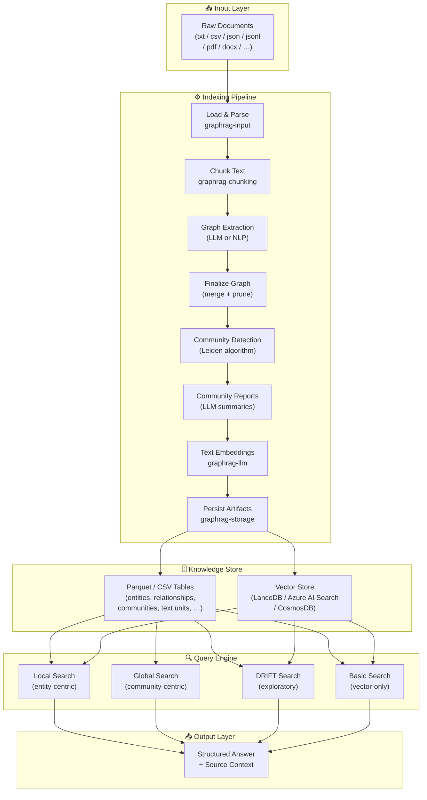
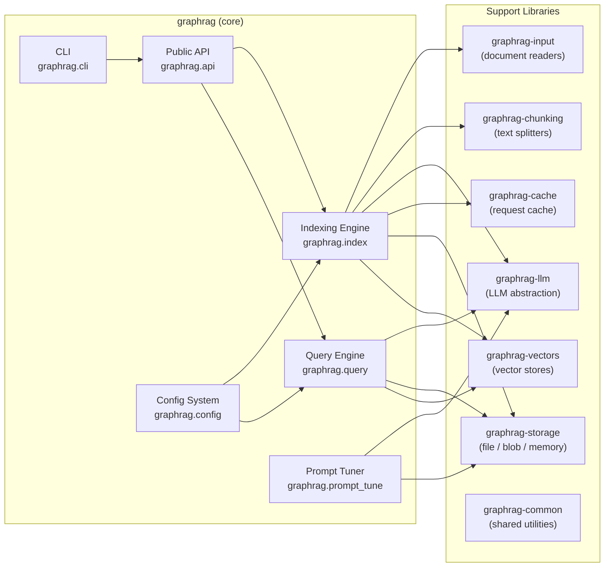
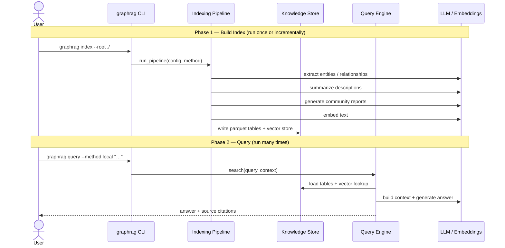

# GraphRAG — Architecture Overview

> Microsoft GraphRAG is a **data pipeline and transformation suite** that converts unstructured text into a richly structured knowledge graph, then uses that graph to answer questions with a language model.

---

## High-Level System Map

---

## Monorepo Package Map

---

## Two-Phase Lifecycle

---

## Indexing Methods

| Method | Graph Extraction | Community Summaries | Notes |
|--------|-----------------|---------------------|-------|
| `standard` | LLM (GPT-4 class) | LLM | Highest quality, most expensive |
| `fast` | NLP (SpaCy / regex) | LLM | Cheaper; skips LLM graph extraction |
| `standard-update` | LLM (incremental) | LLM | Merges new docs into existing index |
| `fast-update` | NLP (incremental) | LLM | Incremental fast mode |

## Query Methods

| Method | Context Source | Best For |
|--------|---------------|----------|
| `local` | Entity graph + text units | Specific entities / facts |
| `global` | Community reports (map-reduce) | Broad themes / summaries |
| `drift` | Hybrid exploratory | Open-ended exploration |
| `basic` | Vector-only text units | Simple semantic search |
