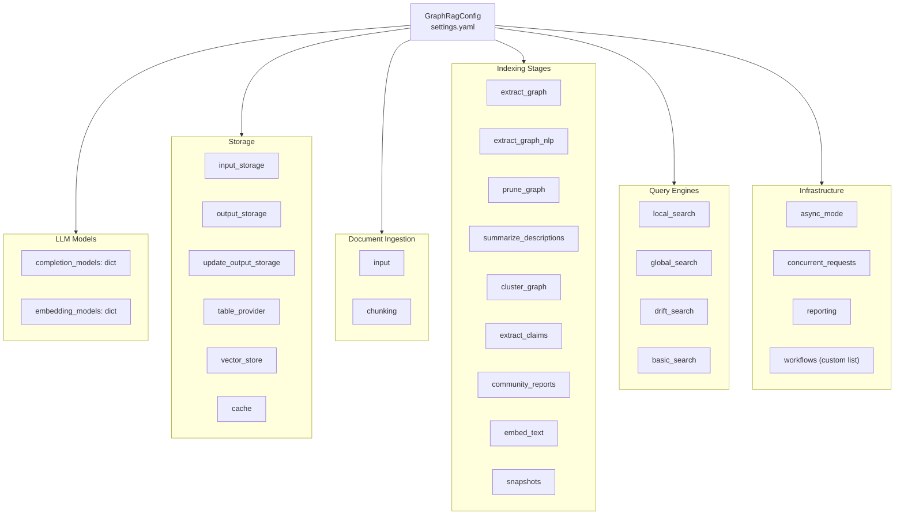
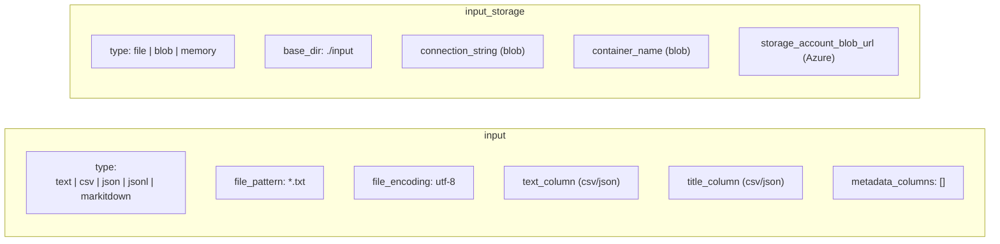
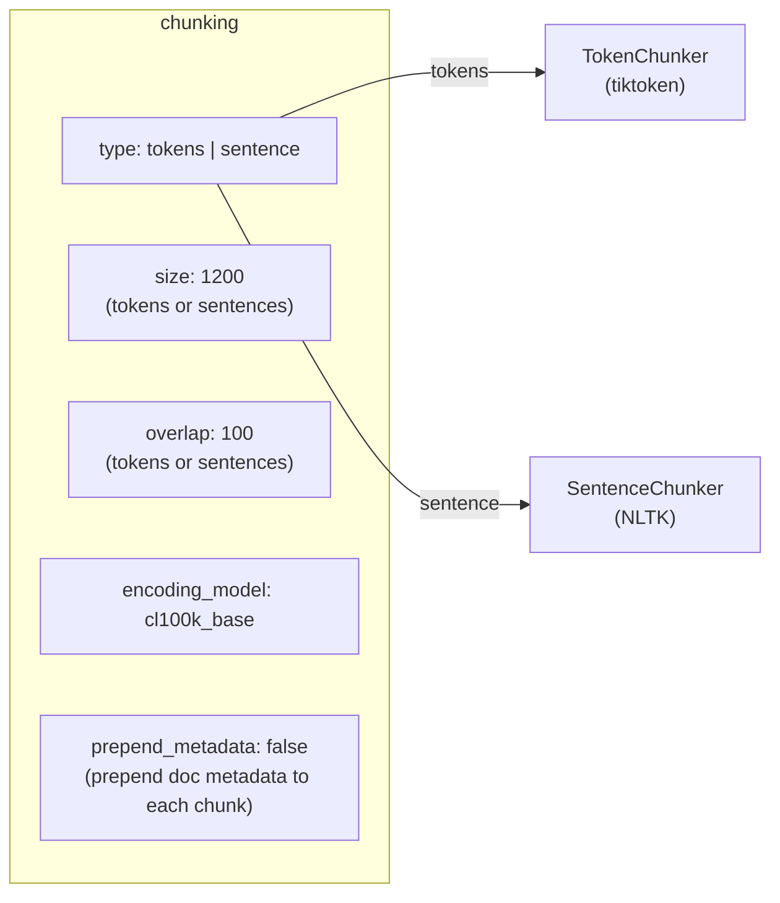
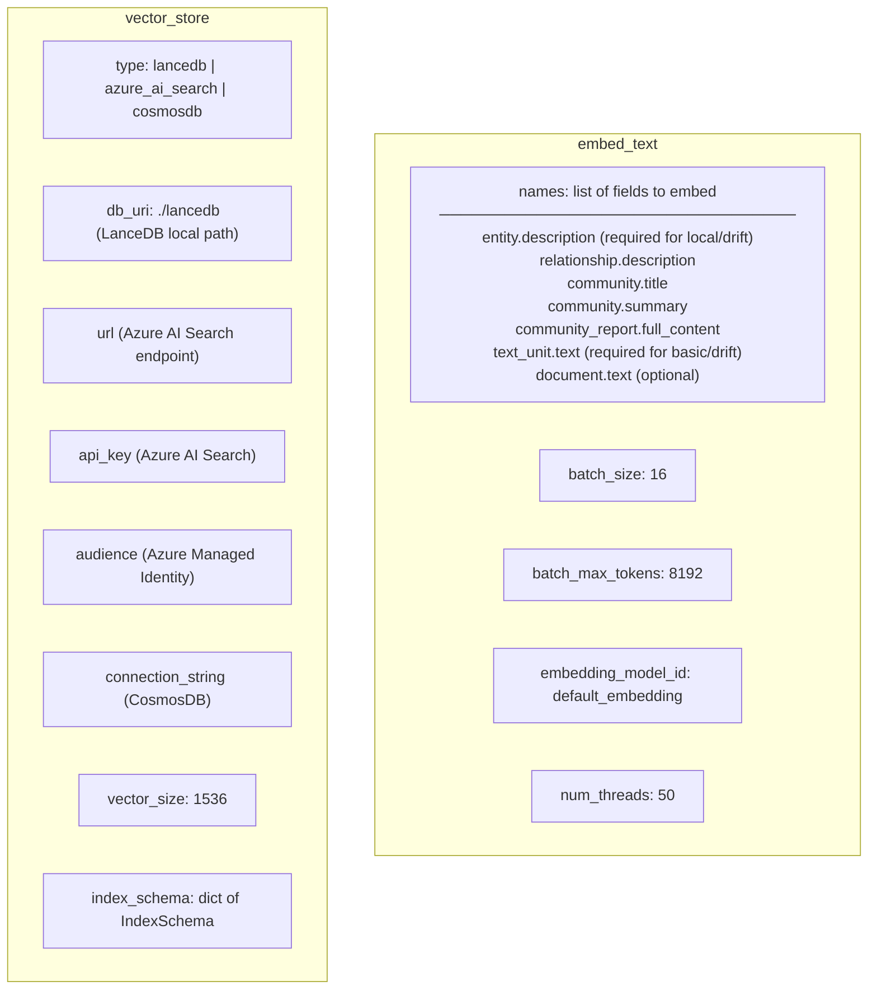
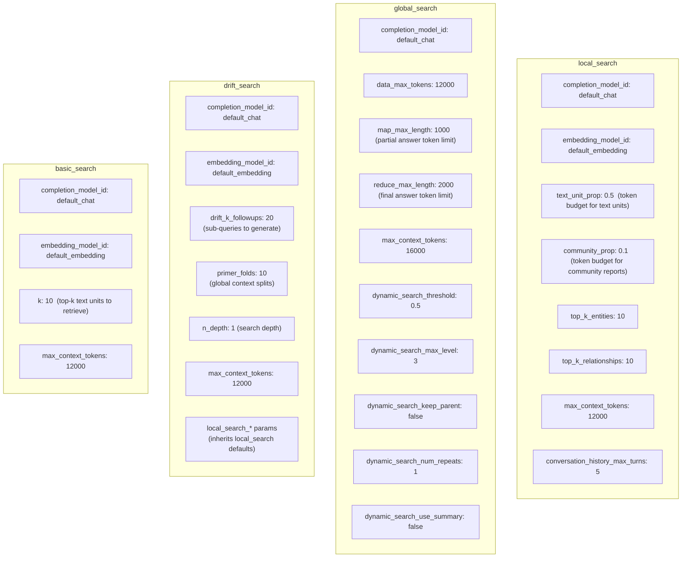
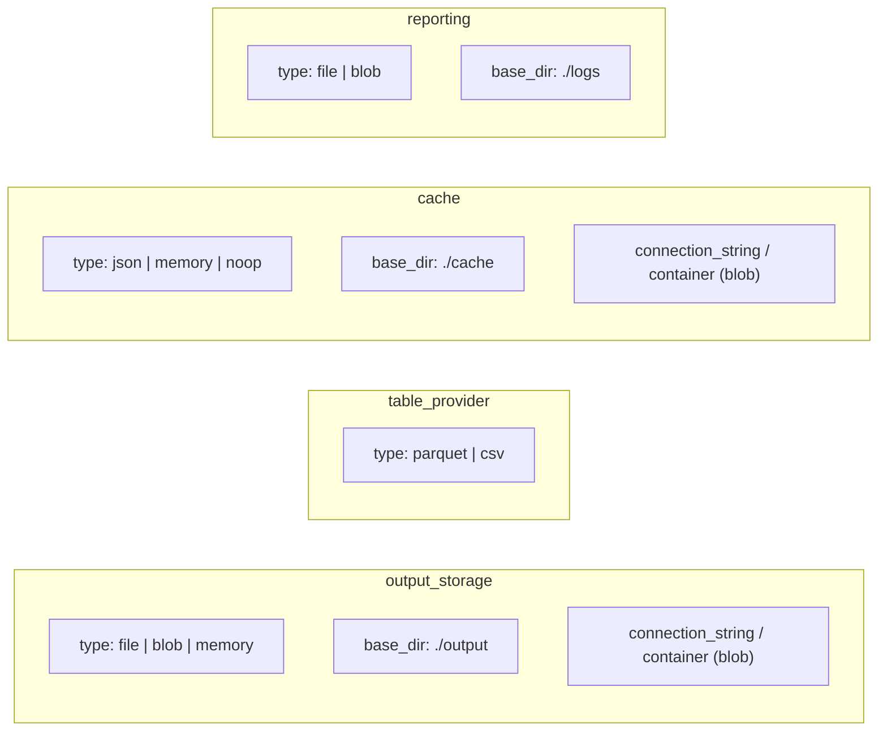
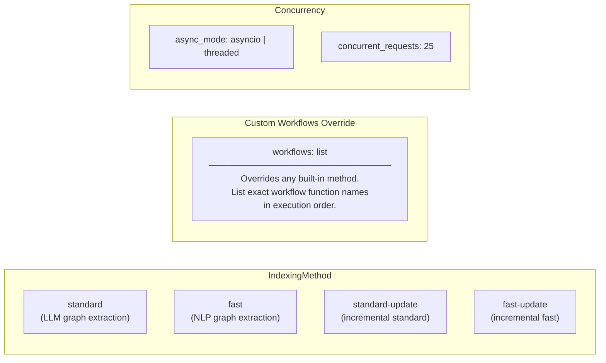
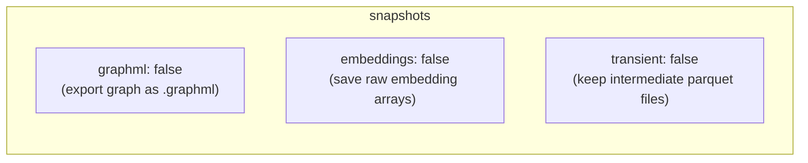
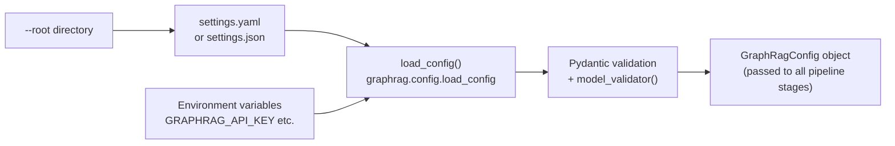

# GraphRAG — Configuration Reference

All configuration lives in a single `settings.yaml` (or `.json`) at the `--root` directory. It maps to the `GraphRagConfig` Pydantic model.

---

## Top-Level Config Structure



---

## LLM Model Configuration

```mermaid
graph LR
    subgraph MODEL_KEYS["completion_models / embedding_models\n(keyed by model_id string)"]
        direction TB
        MK1["api: openai | azure | ollama | litellm"]
        MK2["model: gpt-4o | text-embedding-3-small | …"]
        MK3["api_key: env-var or literal"]
        MK4["api_base: custom endpoint URL"]
        MK5["deployment_name (Azure only)"]
        MK6["api_version (Azure only)"]
        MK7["max_tokens: 4096"]
        MK8["temperature: 0.0"]
        MK9["top_p: 1.0"]
        MK10["n: 1  (completions count)"]
        MK11["request_timeout: 180s"]
        MK12["call_args: dict  (extra kwargs)"]
    end

    subgraph RATE_LIMIT["rate_limit"]
        RL1["requests_per_minute: 0 (unlimited)"]
        RL2["tokens_per_minute: 0"]
    end

    subgraph RETRY_CFG["retry"]
        RC1["max_retries: 10"]
        RC2["strategy: exponential | immediate"]
        RC3["backoff_factor: 1.5"]
        RC4["max_retry_wait: 60s"]
    end

    MODEL_KEYS --> RATE_LIMIT & RETRY_CFG
```



---

## Input Configuration



---

## Chunking Configuration



---

## Graph Extraction Configuration

```mermaid
graph LR
    subgraph EG2["extract_graph  (LLM mode)"]
        direction TB
        EG1["completion_model_id: default_chat"]
        EG2["entity_types:\n[organization, person, geo, event]"]
        EG3["max_gleanings: 1\n(extra LLM passes to find more entities)"]
        EG4["num_threads: 50"]
        EG5["async_mode: asyncio | threaded"]
        EG6["prompt: path/to/custom_prompt.txt"]
    end

    subgraph NLP2["extract_graph_nlp  (NLP mode)"]
        NLP1["extractor_type:\nregex_english | syntactic_parser | cfg"]
        NLP2["num_threads: 50"]
    end

    subgraph PRUNE2["prune_graph  (Fast mode post-NLP)"]
        PR1["min_node_freq: 3"]
        PR2["min_edge_weight_pct: 10"]
        PR3["max_node_freq_std: 3"]
    end
```

---

## Description Summarization

```mermaid
graph LR
    subgraph SD2["summarize_descriptions"]
        SD1["completion_model_id: default_chat"]
        SD2["max_summary_length: 500 chars"]
        SD3["num_threads: 50"]
        SD4["async_mode: asyncio | threaded"]
        SD5["prompt: path/to/custom_prompt.txt"]
    end
```

---

## Community Detection Configuration

```mermaid
graph LR
    subgraph CG2["cluster_graph"]
        CG1["max_cluster_size: 10\n(Leiden max community size)"]
        CG2["use_lcc: true\n(use Largest Connected Component only)"]
        CG3["seed: 0xDEADBEEF\n(reproducibility)"]
    end
```

---

## Community Reports Configuration

```mermaid
graph LR
    subgraph CR2["community_reports"]
        CR1["completion_model_id: default_chat"]
        CR2["max_input_length: 8000 tokens"]
        CR3["max_length: 2000 tokens"]
        CR4["num_threads: 50"]
        CR5["async_mode: asyncio | threaded"]
        CR6["prompt: path/to/custom_prompt.txt"]
    end
```

---

## Covariate (Claims) Configuration

```mermaid
graph LR
    subgraph EC2["extract_claims"]
        EC1["enabled: false  ← disabled by default"]
        EC2["completion_model_id: default_chat"]
        EC3["description: 'Any claims or facts…'"]
        EC4["max_gleanings: 1"]
        EC5["num_threads: 50"]
        EC6["prompt: path/to/custom_prompt.txt"]
    end
```

---

## Embeddings Configuration



---

## Query Engine Configuration



---

## Storage & Cache Configuration



---

## Pipeline Methods & Workflow Override



---

## Snapshots (Debug Artifacts)



---

## Configuration Loading Flow


