# GraphRAG — Indexing Pipeline

The indexing pipeline is a sequenced set of **workflow steps** orchestrated by `PipelineFactory` and executed by `run_pipeline()`. Each step reads from and writes to a shared `PipelineRunContext` (storage + cache + callbacks).

---

## Standard Pipeline — Full Workflow Sequence

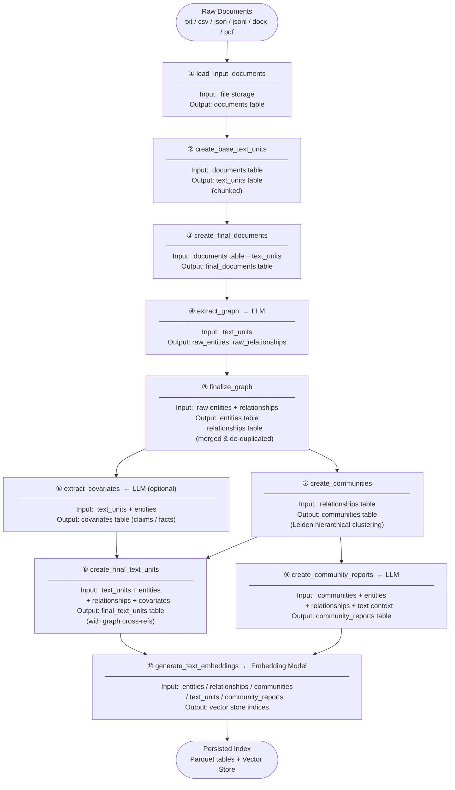

---

## Fast Pipeline — NLP-Based Graph Extraction

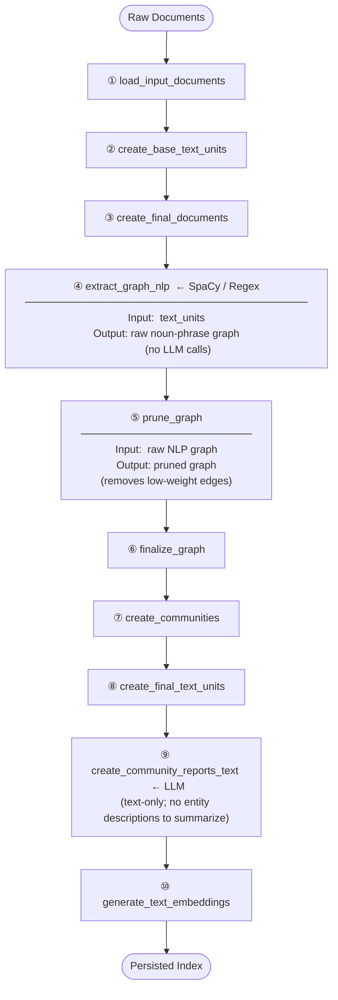

---

## Stage 1 — Document Loading (`load_input_documents`)

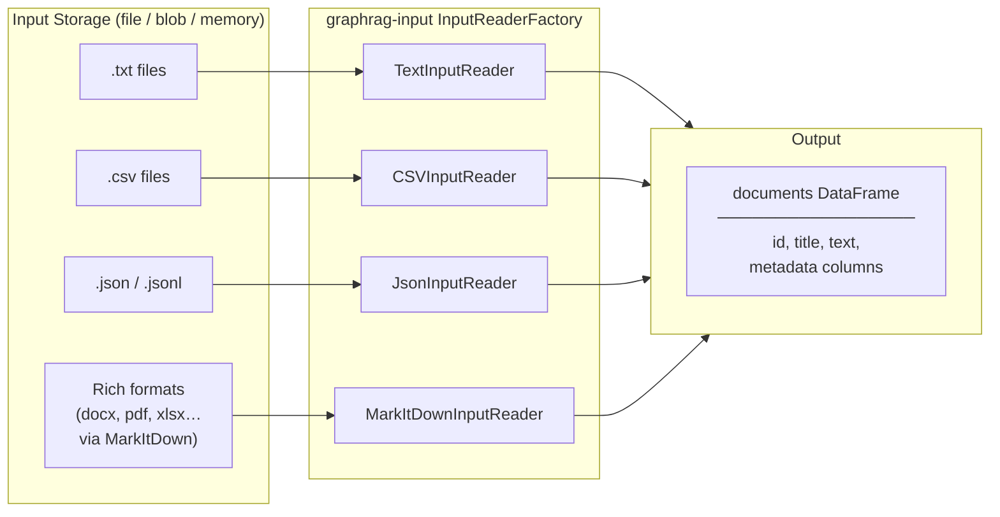

**Config keys:** `input.type`, `input.file_pattern`, `input.file_encoding`, `input.text_column`, `input.title_column`, `input_storage.type / base_dir / connection_string / container_name`

---

## Stage 2 — Text Chunking (`create_base_text_units`)

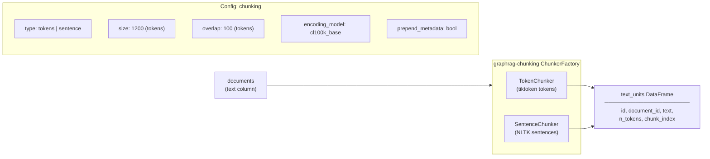

---

## Stage 3 — Graph Extraction (`extract_graph`)

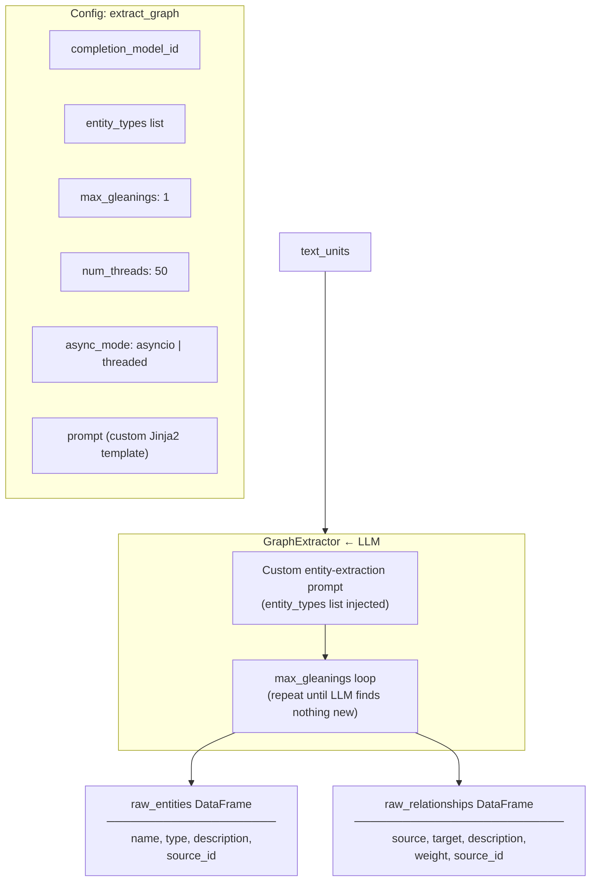

---

## Stage 3-alt — NLP Graph Extraction (`extract_graph_nlp`)

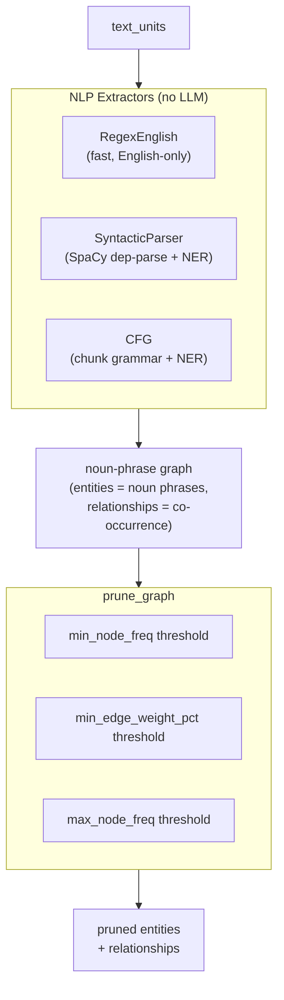

---

## Stage 4 — Graph Finalization (`finalize_graph`)

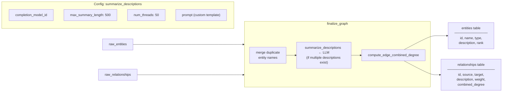

---

## Stage 5 — Community Detection (`create_communities`)

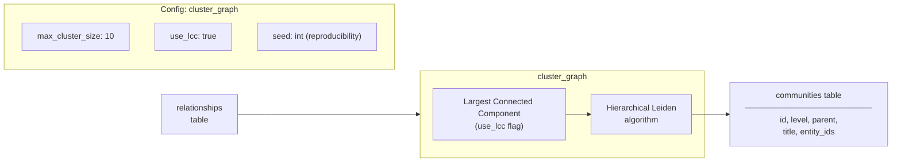

---

## Stage 6 — Community Reports (`create_community_reports`)

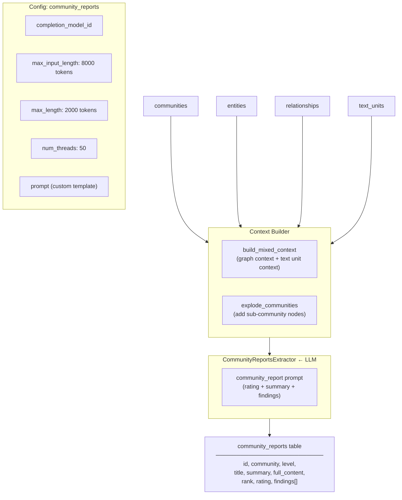

---

## Stage 7 — Covariate Extraction (`extract_covariates`, optional)

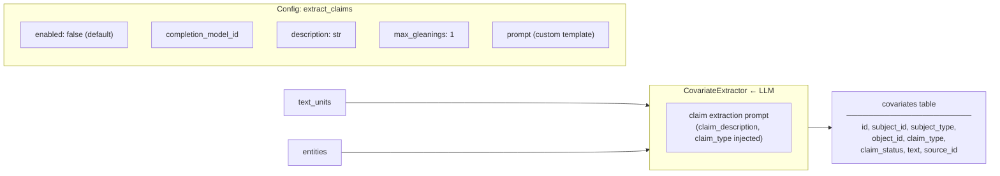

---

## Stage 8 — Text Embeddings (`generate_text_embeddings`)

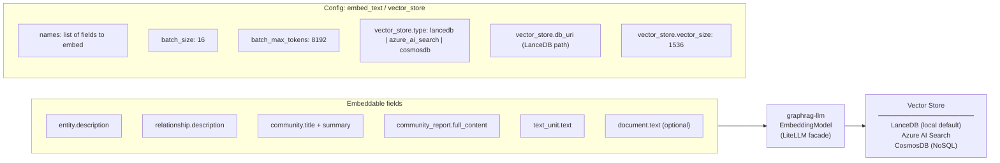

---

## Incremental Update Pipeline

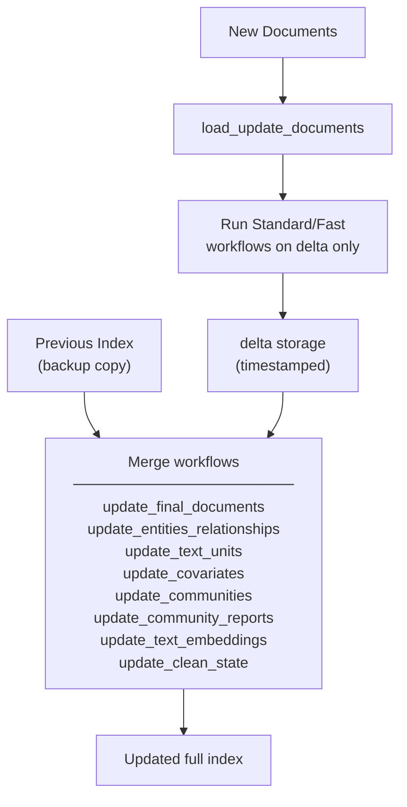

---

## LLM Middleware Stack (all LLM calls)

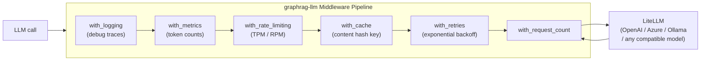
