# GraphRAG — Packages & Modules Reference

The repository is a Python monorepo of **9 packages** under `packages/`. The `graphrag` core package depends on the 8 support libraries below.

---

## Package Dependency Map

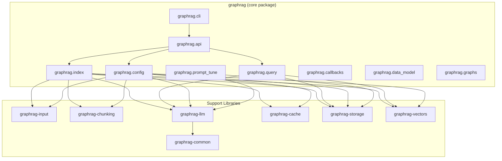

---

## `graphrag` Core Package

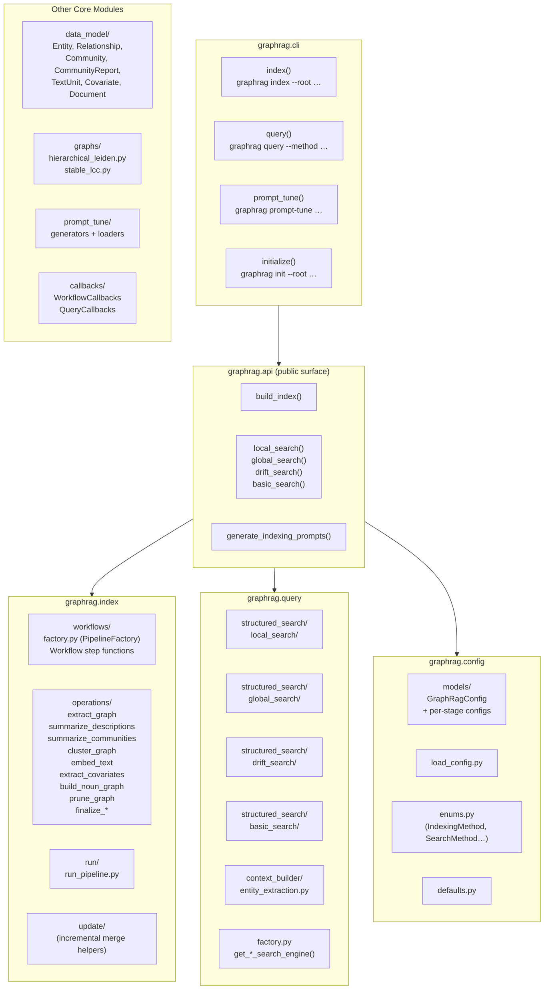

---

## `graphrag-input` — Document Reader

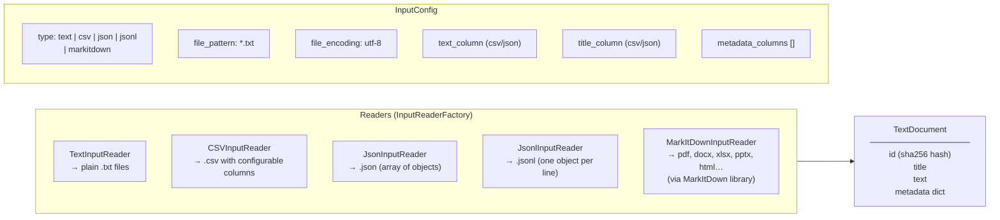

---

## `graphrag-chunking` — Text Splitter

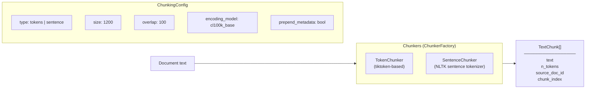

---

## `graphrag-llm` — LLM Abstraction Layer

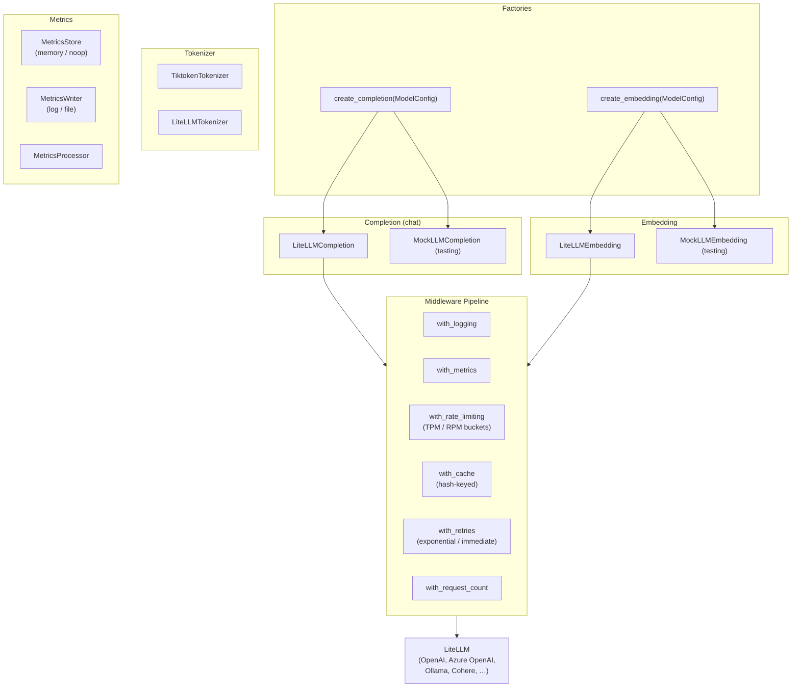

**Key config fields (ModelConfig):**

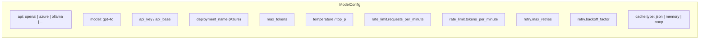

---

## `graphrag-storage` — Persistence Layer

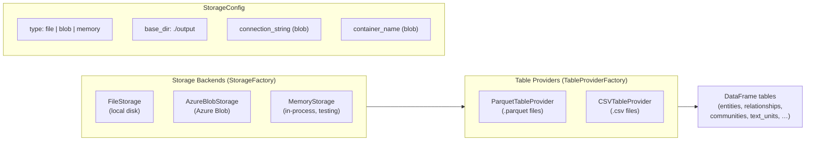

---

## `graphrag-vectors` — Vector Store

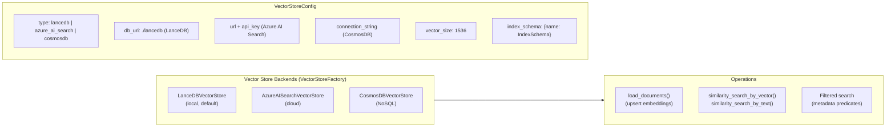

---

## `graphrag-cache` — LLM Request Cache

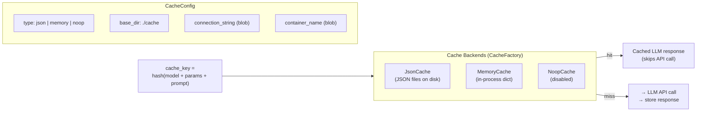

---

## `graphrag-common` — Shared Utilities

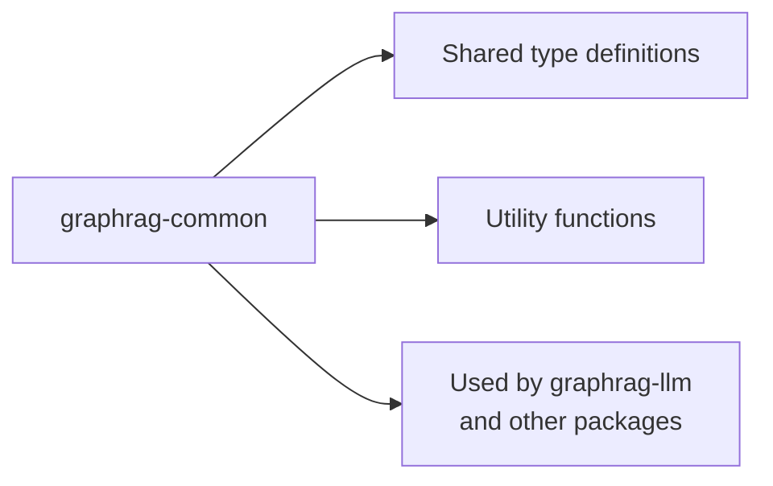

---

## Data Model Objects (`graphrag.data_model`)

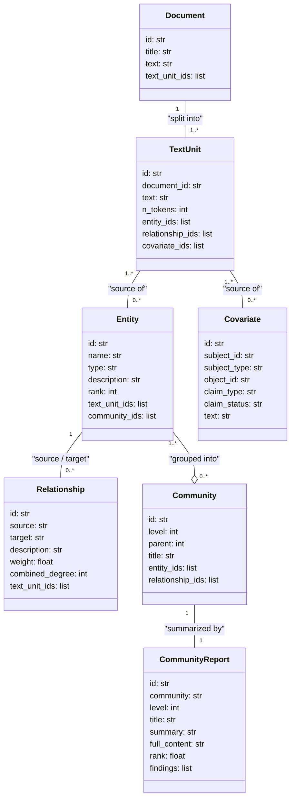
