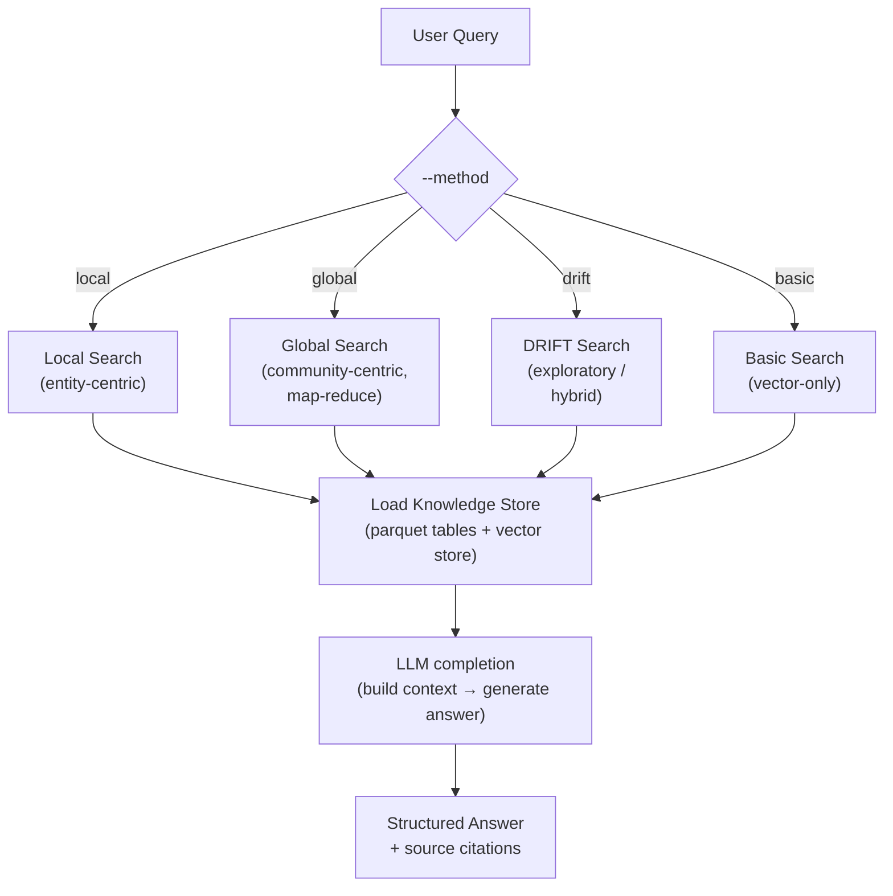
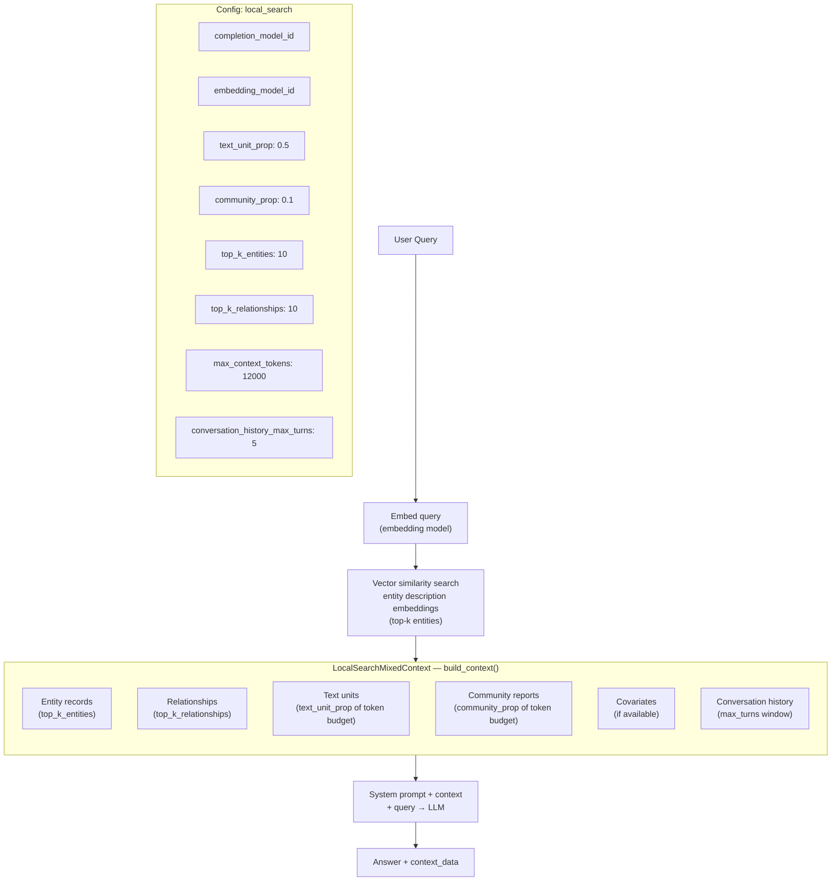
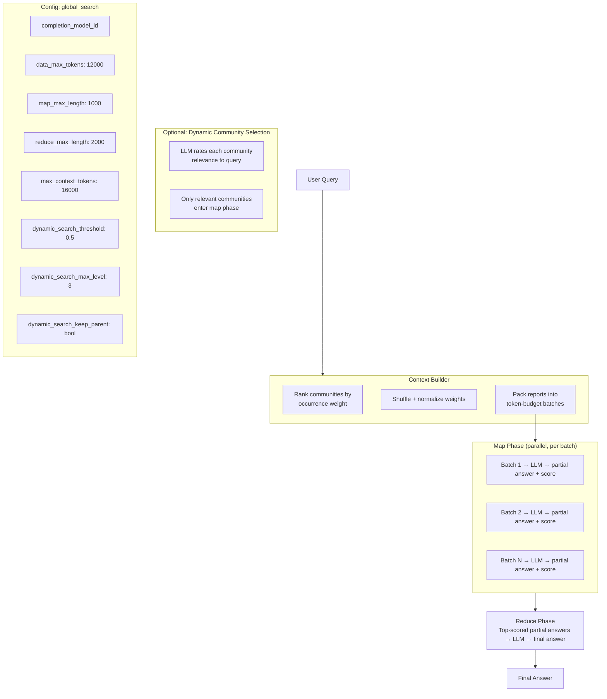
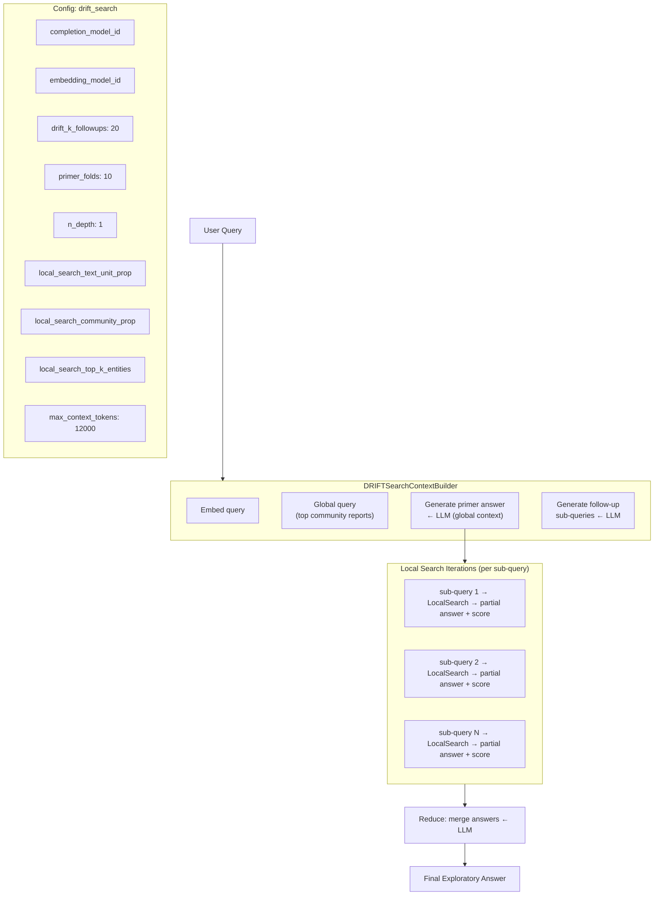
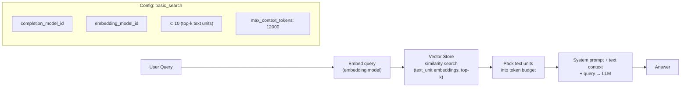
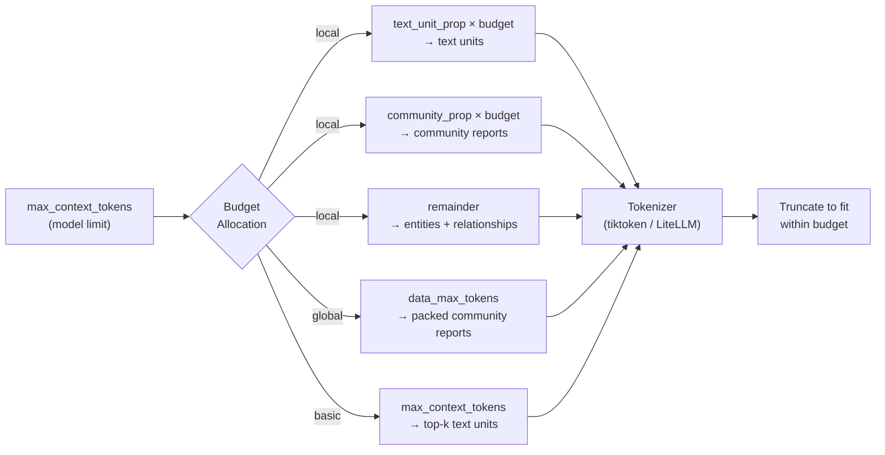
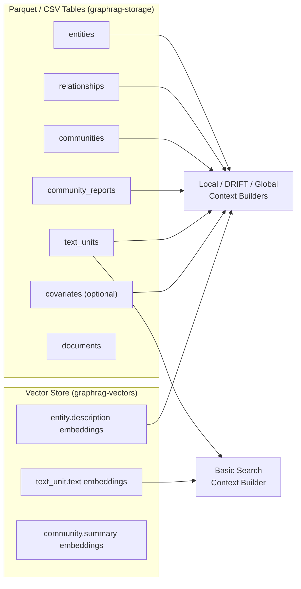
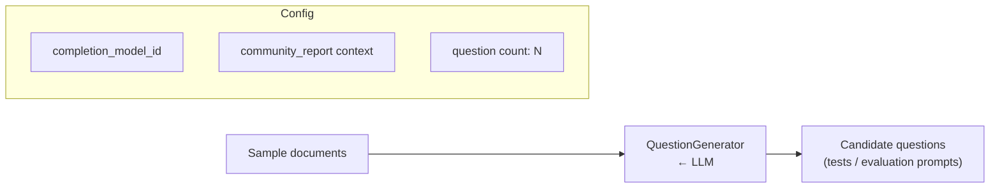

# GraphRAG — Query Pipeline

The query engine loads the persisted knowledge index and uses one of four **search strategies** to answer user questions with an LLM.

---

## Query Method Selection

---

## Local Search — Detailed Flow

Best for: **specific entities, facts, and relationships** within the graph.

---

## Global Search — Map-Reduce Flow

Best for: **broad thematic questions** that span the entire corpus.

---

## DRIFT Search — Exploratory Hybrid Flow

Best for: **open-ended exploration** mixing global themes with local entity detail.

---

## Basic Search — Vector-Only Flow

Best for: **simple semantic similarity** search without graph traversal.

---

## Context Window Budget Management

All search methods share the same token-budget approach:

---

## Query Data Loading

---

## Question Generation (Prompt Tuning helper)

