# USB-PD Hybrid RAG Pipeline — Implementation Breakdown

> This document maps each stage of the Microsoft GraphRAG pipeline to the specific USB-PD AI Reasoning Platform requirements. Input sources are `spec.md` (USB-PD 3.2 Specification), `cts.md` (Compliance Test Specification), and `vif.md` (Vendor Info File Definition). The retrieval model is **Graph-first + Vector-augmented + Metadata-filtered**.

---

## Pipeline Architecture Overview

```mermaid
flowchart TD
    subgraph SOURCES["📥 Input Sources"]
        S1["spec.md\nUSB-PD 3.2 Specification\n~1000+ pages, protocol rules,\nstate diagrams, timers, message formats"]
        S2["cts.md\nCompliance Test Specification\nTest procedures, checks, timing tables,\nAMS-level test sequences"]
        S3["vif.md\nVendor Info File Definition\nDevice capability fields,\nPDO declarations, VIF constraints"]
    end

    subgraph STAGE1["Stage 1: Document Ingestion & Normalization"]
        P1["Parse + Tag by Source\nAssign doc_type metadata\n(spec | cts | vif)"]
    end

    subgraph STAGE2["Stage 2: Domain-Aware Chunking"]
        P2["Section-boundary chunking\nPreserve AMS boundaries,\ntest IDs, clause numbers,\ntimer/rule cross-refs"]
    end

    subgraph STAGE3["Stage 3: Graph Extraction"]
        P3_LLM["LLM Mode: extract\nentities + relationships\nper USB-PD ontology"]
        P3_NLP["NLP Mode (fast): extract\nnoun phrases from protocol\nvocabulary"]
    end

    subgraph STAGE4["Stage 4: Graph Finalization"]
        P4["Merge entity variants,\nlink spec ↔ cts ↔ vif,\ncompute AMS community clusters"]
    end

    subgraph STAGE5["Stage 5: Community Detection"]
        P5["Leiden clustering on\nprotocol entity graph\n→ AMS communities,\nrule groups, message families"]
    end

    subgraph STAGE6["Stage 6: Community Reports"]
        P6["LLM summaries per community:\nAMS flows, rule sets,\ntest procedure clusters"]
    end

    subgraph STAGE7["Stage 7: Metadata Enrichment & Filtering Schema"]
        P7["Tag all entities with:\ndoc_type, spec_revision,\nams_type, rule_id, test_id,\npdo_type, sop_domain, severity"]
    end

    subgraph STAGE8["Stage 8: Text Embeddings"]
        P8["Embed: spec clauses,\nrule descriptions, test steps,\ncommunity summaries,\nVIF field definitions"]
    end

    subgraph KNOWLEDGE["🗄️ Knowledge Store"]
        KG["Knowledge Graph\n(entities + relationships)"]
        VS["Vector Store\n(semantic embeddings)"]
        META["Metadata Filters\n(structured predicates)"]
    end

    subgraph QUERY["🔍 Hybrid Query Engine"]
        QG["Graph-first:\nAMS traversal, rule chains,\ncausal paths"]
        QV["Vector-augmented:\nsemantic spec clause retrieval"]
        QM["Metadata-filtered:\nspec_revision, ams_type,\ntest_id, severity"]
    end

    SOURCES --> STAGE1 --> STAGE2 --> STAGE3 --> STAGE4 --> STAGE5 --> STAGE6 --> STAGE7 --> STAGE8
    STAGE4 --> KG
    STAGE8 --> VS
    STAGE7 --> META
    KG & VS & META --> QUERY
```

---

## Stage 1 — Document Ingestion & Normalization

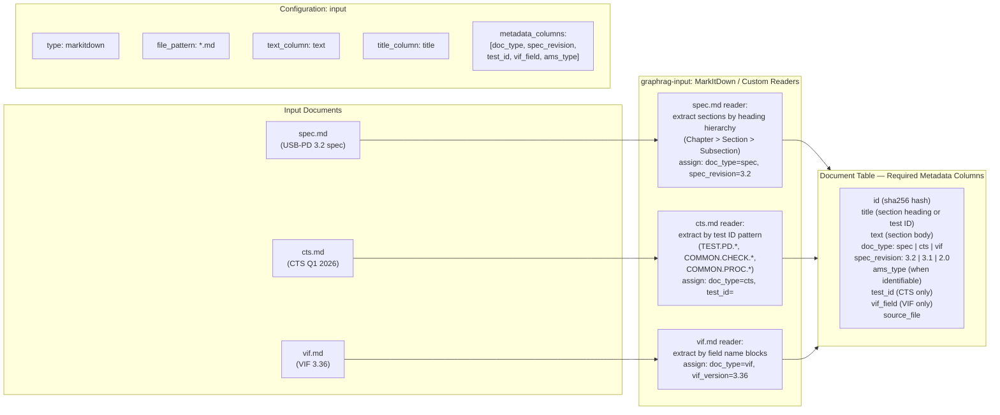

**Key decisions for this stage:**

- `spec.md` — split at clause level (e.g. `6.3.7 PS_RDY Message`, `8.3.2 AMS Diagrams`). Each clause becomes one document record. Tag with `spec_revision=3.2` and extract clause ID as title.
- `cts.md` — split at test procedure level (`TEST.PD.PROT.SRC3.1`, `COMMON.CHECK.PD.3`). Each named test/check procedure becomes one record. Tag with `test_id` and applicable UUT type.
- `vif.md` — split at field definition level (e.g. `Num_Src_PDOs`, `Has_Invariant_PDOs`, `EPR_Supported_As_Src`). Each field group becomes one record.
- All records get `doc_type` metadata — this is the primary filter dimension for the query engine.

---

## Stage 2 — Domain-Aware Chunking

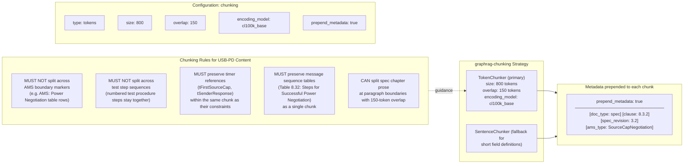

**Key decisions for this stage:**

- Smaller chunks (800 tokens) than default (1200) because USB-PD spec text is dense — each sentence can carry a separate normative requirement with a distinct SHALL/SHALL NOT.
- 150-token overlap ensures timing constraint context (e.g. `tSenderResponse` value) is never orphaned from the step that references it.
- `prepend_metadata: true` embeds `doc_type`, `clause`, `ams_type` at the start of each chunk so the embedding captures the semantic context of the domain.

---

## Stage 3 — Graph Extraction (Dual-Mode)

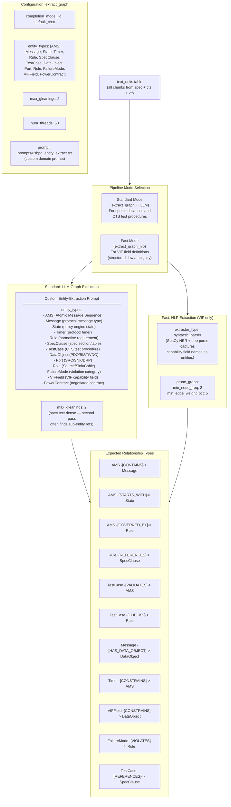

**Custom prompt guidance (entity extraction):**

The entity extraction prompt must be tuned to recognize USB-PD-specific patterns:
- AMS names: `SourceCapNegotiation`, `PowerRoleSwap`, `VCONNSwap`, `CableDiscovery`, `EPREntry`
- Message names: `Source_Capabilities`, `Request`, `Accept`, `Reject`, `Wait`, `PS_RDY`, `GoodCRC`, `Soft_Reset`, `Hard_Reset`, `Get_Source_Cap`, `Get_Source_Cap_Extended`
- Timer names: `tFirstSourceCap`, `tSenderResponse`, `tTypeCSendSourceCap`, `tReceive`, `tRetry`, `tHardResetComplete`
- Rule patterns: `[TEST.PD.PROT.SRC3.1#1]` anchors, `[COMMON.CHECK.PD.3#1]` anchors, `SHALL`, `shall not`
- State names: `PE_SRC_Ready`, `PE_SNK_Ready`, `PE_SRC_Send_Capabilities`, `PE_SRC_Wait_New_Capabilities`

---

## Stage 4 — Graph Finalization & Cross-Document Linking

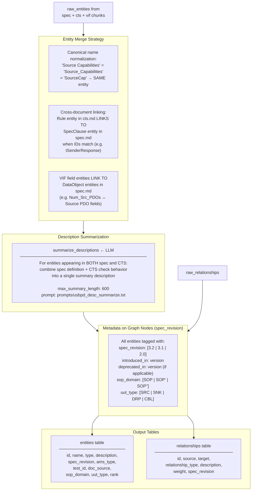

**Critical cross-document links to establish:**

- `TEST.PD.PROT.SRC3.1` (CTS test) → `LINKS_TO` → `SourceCapabilityTimer` (spec entity) → `GOVERNED_BY` → clause `6.6.x` (spec)
- `TEST.PD.PROT.SRC3.2` (CTS test) → `LINKS_TO` → `SenderResponseTimer` → `CONSTRAINS` → `SourceCapNegotiation` AMS
- `COMMON.CHECK.PD.3` → `VALIDATES` → `GoodCRC` message sequence in spec
- `Num_Src_PDOs` (VIF field) → `CONSTRAINS` → `Source_Capabilities` message → `GOVERNS` → `SourceCapNegotiation` AMS
- `Has_Invariant_PDOs` (VIF field) → `GOVERNS` → `COMMON.PROC.PD.18` procedure

---

## Stage 5 — Community Detection (AMS Clustering)

```mermaid
flowchart LR
    RELS["relationships\ntable"] --> LEIDEN

    subgraph LEIDEN["Leiden Clustering — Expected Communities"]
        C1["Community L0: Source Capability Negotiation AMS\n(Source_Capabilities, Request, Accept/Reject/Wait,\nPS_RDY, GoodCRC, tFirstSourceCap, tSenderResponse,\nTEST.PD.PROT.SRC3.1–3.15, related VIF fields)"]
        C2["Community L0: Protocol Error & Reset AMS\n(Soft_Reset, Hard_Reset, tProtErrSoftReset,\nCOMMON.CHECK.PD.5, COMMON.CHECK.PD.3)"]
        C3["Community L0: Power Role Swap AMS\n(PR_Swap, DR_Swap, Accept/Reject/Wait,\nPS_RDY, vSafe0V, COMMON.PROC.BU.*)"]
        C4["Community L0: VCONN Swap AMS\n(VCONN_Swap, tVCONNSourceOn, tVCONNSourceOff,\nTEST.PD.PROT.SRC.8)"]
        C5["Community L0: EPR Entry AMS\n(EPR_Mode, EPR_Request, EPR_Source_Capabilities,\nEPR_Supported_As_Src VIF fields)"]
        C6["Community L0: VIF Capability Model\n(VIF fields: Has_Invariant_PDOs, Num_Src_PDOs,\nSrc_PDO_*, EPR_Mode_Capable, PD_Port_Type)"]
        C7["Community L1 (parent): Full Source Protocol\nSubcommunities: SrcCap + Reset + PRSwap"]
        C8["Community L1 (parent): EPR Protocol\nSubcommunities: EPR Entry + EPR SrcCap"]
    end

    subgraph CFG5["Configuration: cluster_graph"]
        CL1["max_cluster_size: 12\n(USB-PD AMS groups are\nnaturally 8-15 entities)"]
        CL2["use_lcc: true"]
        CL3["seed: 42 (reproducibility)"]
    end

    LEIDEN --> COMM["communities table\n───────────────────────────\nid, level, parent,\ntitle, entity_ids\n(AMS-aligned clusters)"]
```

---

## Stage 6 — Community Reports (AMS Knowledge Summaries)

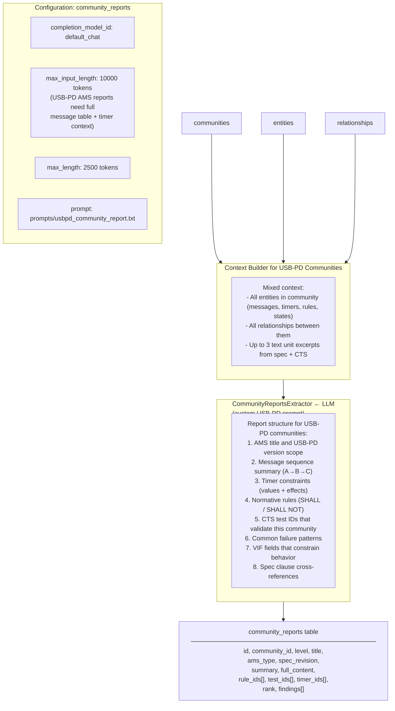

---

## Stage 7 — Metadata Schema for Filtering

This stage defines the filterable metadata dimensions applied to all graph entities, vector store documents, and community reports. This is the "metadata filtration" layer of the hybrid pipeline.

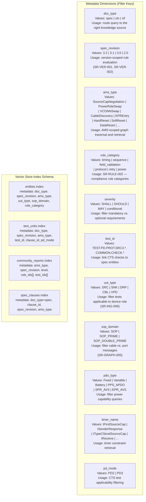

---

## Stage 8 — Text Embeddings

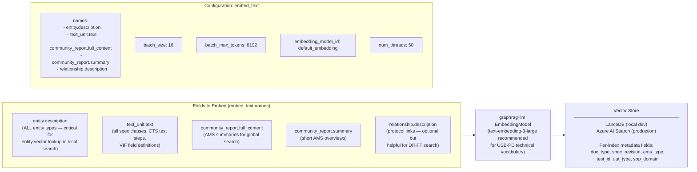

---

## Stage 9 — Hybrid Query Engine (Graph + Vector + Metadata Filter)

This is the core runtime of the platform. Per `SR-RAG-001`: graph-first retrieval, then vector augmentation.

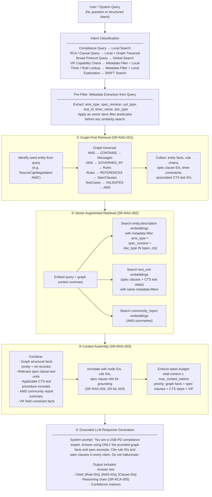

---

## Stage 9a — Query Mode: Compliance Check

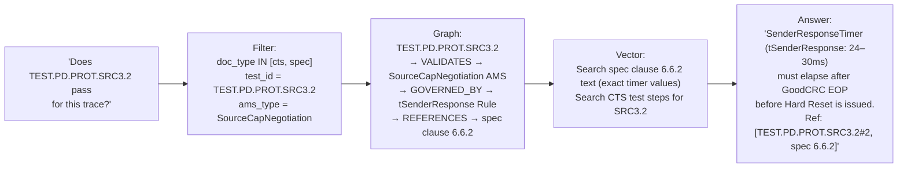

---

## Stage 9b — Query Mode: RCA Traversal

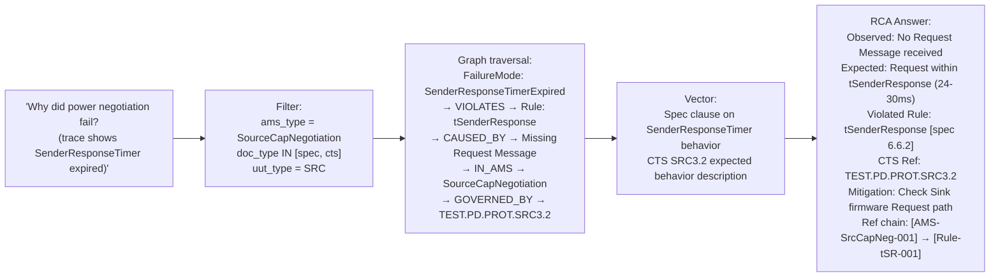

---

## Stage 9c — Query Mode: VIF Capability Filter

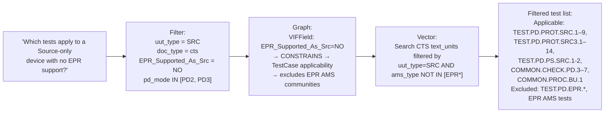

---

## Incremental Update Pipeline (Phase 2+)

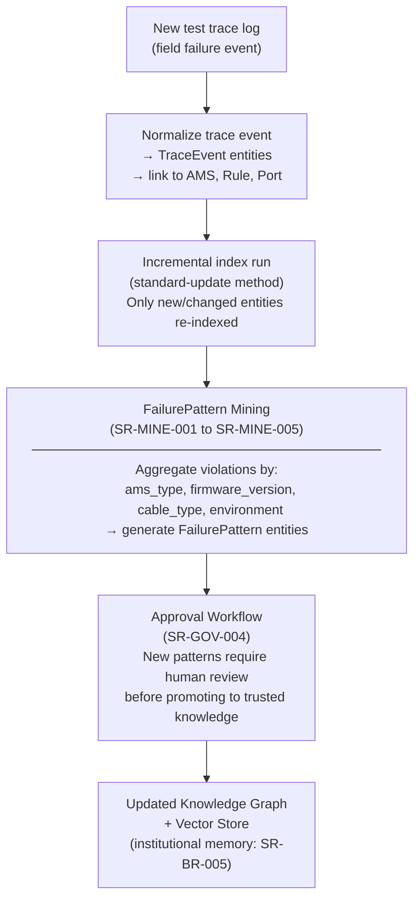

---

## Configuration File Summary

```mermaid
graph TB
    subgraph SETTINGS["settings.yaml — Key Configuration Blocks"]
        S1["completion_models:\n  default_chat:\n    api: azure\n    model: gpt-4o\n    max_tokens: 4096\n    rate_limit:\n      requests_per_minute: 60\n    retry:\n      max_retries: 10"]

        S2["embedding_models:\n  default_embedding:\n    api: azure\n    model: text-embedding-3-large\n    rate_limit:\n      tokens_per_minute: 350000"]

        S3["input:\n  type: markitdown\n  file_pattern: '*.md'\n  metadata_columns:\n    - doc_type\n    - spec_revision\n    - ams_type\n    - test_id\n    - uut_type"]

        S4["chunking:\n  type: tokens\n  size: 800\n  overlap: 150\n  prepend_metadata: true"]

        S5["extract_graph:\n  entity_types: [AMS, Message, State, Timer,\n    Rule, SpecClause, TestCase, DataObject,\n    Port, Role, FailureMode, VIFField]\n  max_gleanings: 2\n  prompt: prompts/usbpd_entity_extract.txt"]

        S6["cluster_graph:\n  max_cluster_size: 12\n  use_lcc: true\n  seed: 42"]

        S7["community_reports:\n  max_input_length: 10000\n  max_length: 2500\n  prompt: prompts/usbpd_community_report.txt"]

        S8["embed_text:\n  names:\n    - entity.description\n    - text_unit.text\n    - community_report.full_content\n    - community_report.summary\n  batch_size: 16"]

        S9["vector_store:\n  type: lancedb  # or azure_ai_search\n  vector_size: 3072  # text-embedding-3-large\n  index_schema:\n    entity.description:\n      metadata: [doc_type, spec_revision,\n        ams_type, uut_type, sop_domain]\n    text_unit.text:\n      metadata: [doc_type, clause_id,\n        test_id, ams_type, pd_mode]"]

        S10["local_search:\n  text_unit_prop: 0.4\n  community_prop: 0.15\n  top_k_entities: 15\n  top_k_relationships: 15\n  max_context_tokens: 14000"]

        S11["global_search:\n  data_max_tokens: 14000\n  map_max_length: 1500\n  reduce_max_length: 3000\n  max_context_tokens: 18000"]
    end
```

---

## Phase Mapping to Pipeline Stages

```mermaid
gantt
    title Implementation Phases vs. Pipeline Stages
    dateFormat  X
    axisFormat  Phase %s

    section Phase 1 MVP
    Stage 1 Document Ingestion (spec.md only + cts SRC section) :done, p1s1, 1, 2
    Stage 2 Chunking (SourceCapNeg AMS chunks) :done, p1s2, 2, 3
    Stage 3 Graph Extraction (5 core entities) :done, p1s3, 3, 4
    Stage 4 Finalization (spec↔CTS links) :done, p1s4, 4, 5
    Stage 5 Communities (SourceCapNeg community) :done, p1s5, 5, 6
    Stage 6 Community Reports (1 AMS report) :done, p1s6, 6, 7
    Stage 7 Metadata Schema (core filter keys) :done, p1s7, 7, 8
    Stage 8 Embeddings (entity + text_unit) :done, p1s8, 8, 9
    Stage 9 Local Search + Compliance query mode :done, p1s9, 9, 10

    section Phase 2
    All 3 sources ingested (spec + cts + vif) :p2s1, 10, 12
    All entity types extracted :p2s2, 11, 13
    VIF↔spec cross-links :p2s3, 12, 14
    Multi-AMS communities :p2s4, 13, 15
    Global + DRIFT search modes :p2s5, 14, 16
    Failure Pattern mining :p2s6, 15, 17

    section Phase 3
    Incremental update pipeline :p3s1, 17, 20
    Causal pattern clustering :p3s2, 18, 21
    Cross-version regression detection :p3s3, 19, 22
```
