# USB-PD Source Capability Sequence — RAG Test Plan

> This document defines the step-by-step test plan for validating the hybrid RAG pipeline against the **Source Capabilities Negotiation AMS** (Atomic Message Sequence) using the USB-PD 3.2 Specification (`spec.md`) as the knowledge source. It maps each CTS test case from `cts.md` (Section 5.3) to expected graph retrievals, vector lookups, and answer validation criteria.

---

## What Is Source Capability Sequence?

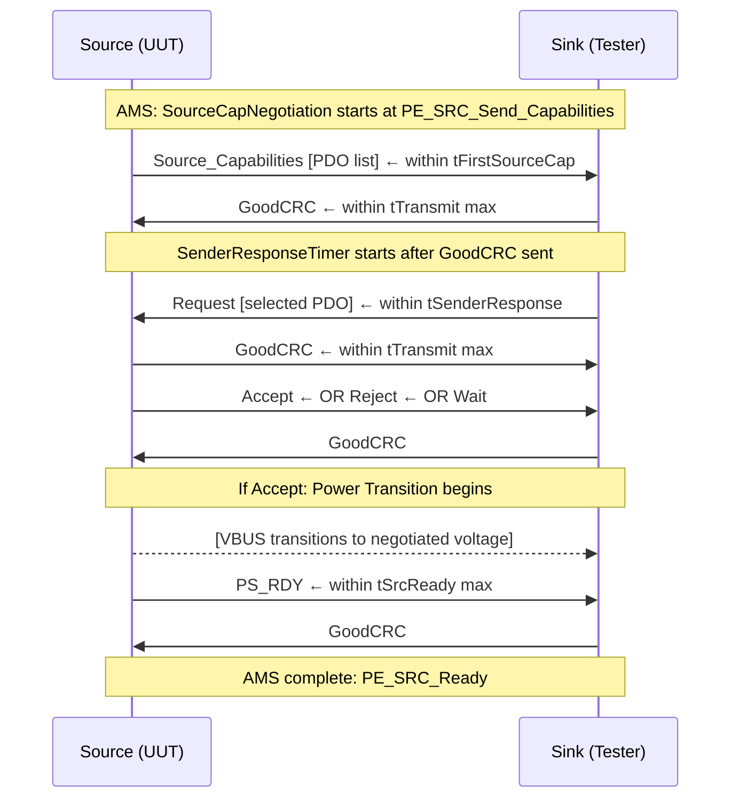

**Key timers under test:**

| Timer | Min | Max | Source |
|-------|-----|-----|--------|
| `tFirstSourceCap` | — | 250 ms | spec §6.6.x |
| `tSenderResponse` | 24 ms | 30 ms | spec §6.6.2 |
| `tTypeCSendSourceCap` | 100 ms | 200 ms | spec (SourceCapabilityTimer) |
| `tReceive` | — | 1.1 ms | spec |
| `tRetry` | — | 195 µs | spec |
| `tTransmit` | — | 195 µs | spec |
| `tSrcReady` | — | 285 ms (SPR) | spec §7.x |

---

## Test Coverage Map — CTS Source-Capable Tests

```mermaid
graph TB
    subgraph PD2_PD3["Section 5.3.1 — PD2 and PD3 Modes (SRC)"]
        T01["TEST.PD.PROT.SRC.1\nGet_Source_Cap Response"]
        T02["TEST.PD.PROT.SRC.2\nGet_Source_Cap No Request"]
        T03["TEST.PD.PROT.SRC.3\nSenderResponseTimer Deadline"]
        T04["TEST.PD.PROT.SRC.4\nReject Request"]
        T05["TEST.PD.PROT.SRC.5\nReject Request Invalid Object Position"]
        T06["TEST.PD.PROT.SRC.6\nAtomic Message Sequence - Request"]
        T07["TEST.PD.PROT.SRC.7\nDR_Swap"]
        T08["TEST.PD.PROT.SRC.8\nVCONN_Swap Response"]
        T09["TEST.PD.PROT.SRC.9\nPR_Swap Response"]
    end

    subgraph PD3_ONLY["Section 5.3.2 — PD3 Mode Only (SRC)"]
        T10["TEST.PD.PROT.SRC3.1\nSourceCapabilityTimer Timeout"]
        T11["TEST.PD.PROT.SRC3.2\nSenderResponseTimer Timeout"]
        T12["TEST.PD.PROT.SRC3.3\nGet_Source_Cap_Extended Response"]
        T13["TEST.PD.PROT.SRC3.4\nAlert Response Source Input Change"]
        T14["TEST.PD.PROT.SRC3.5\nAlert Response Battery Status Change"]
        T15["TEST.PD.PROT.SRC3.6\nSoft Reset Sent when SinkTxOK"]
        T16["TEST.PD.PROT.SRC3.7\nGet_PPS_Status Response"]
        T17["TEST.PD.PROT.SRC3.13\nSource Power Rule Check"]
        T18["TEST.PD.PROT.SRC3.14\nSource Info Response"]
        T19["TEST.PD.PROT.SRC3.15\nAlert Response Extended Alert"]
    end

    subgraph COMMON["Common Checks Used Across SRC Tests"]
        CC1["COMMON.CHECK.PD.2\nMessage Header Check"]
        CC2["COMMON.CHECK.PD.3\nGoodCRC Check"]
        CC3["COMMON.CHECK.PD.4\nAMS Response Timing"]
        CC4["COMMON.CHECK.PD.5\nSoft Reset Check"]
        CC5["COMMON.CHECK.PD.7\nSource Capabilities Check"]
        CC6["COMMON.CHECK.PD.11\nSource Capabilities Extended Check"]
        CC7["COMMON.PROC.BU.1\nBring-up Procedure (SRC)"]
        CC8["COMMON.PROC.PD.18\nSource Capabilities Mismatch Handling"]
    end

    T01 & T02 & T03 & T04 & T05 & T06 --> SRCCAP_CORE["Core SourceCapNeg AMS"]
    T10 & T11 --> TIMER_TESTS["Timer Compliance Tests"]
    T12 & T13 & T14 & T15 --> EXTENDED_MSG["Extended Message Tests"]
    SRCCAP_CORE & TIMER_TESTS & EXTENDED_MSG --> CC1 & CC2 & CC3
```

---

## RAG Test Plan — Per Test Case

### TEST GROUP 1: Core Source Capability Message Sequence

---

#### TEST.PD.PROT.SRC.1 — Get_Source_Cap Response

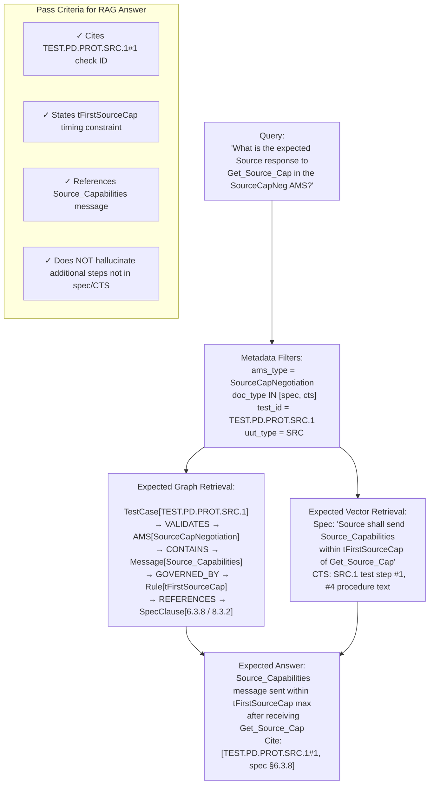

---

#### TEST.PD.PROT.SRC.2 — Get_Source_Cap No Request (Hard Reset Path)

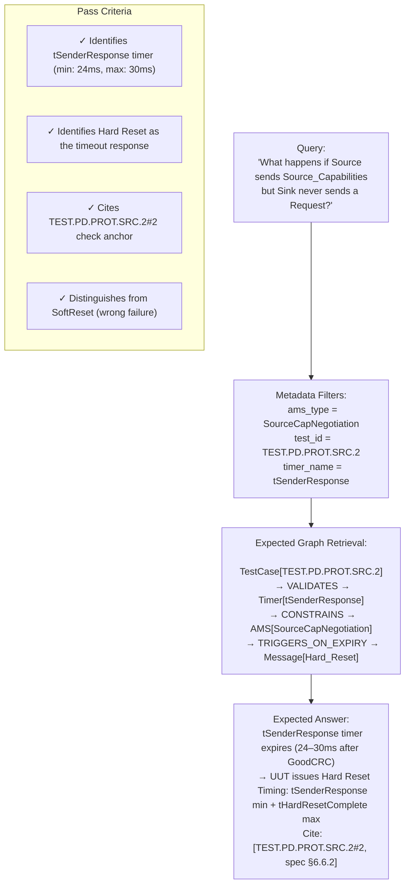

---

#### TEST.PD.PROT.SRC.4 — Reject Request

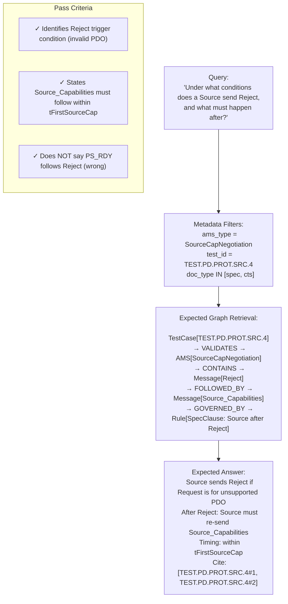

---

#### TEST.PD.PROT.SRC.6 — AMS Sequence Violation (Interrupt by non-AMS message)

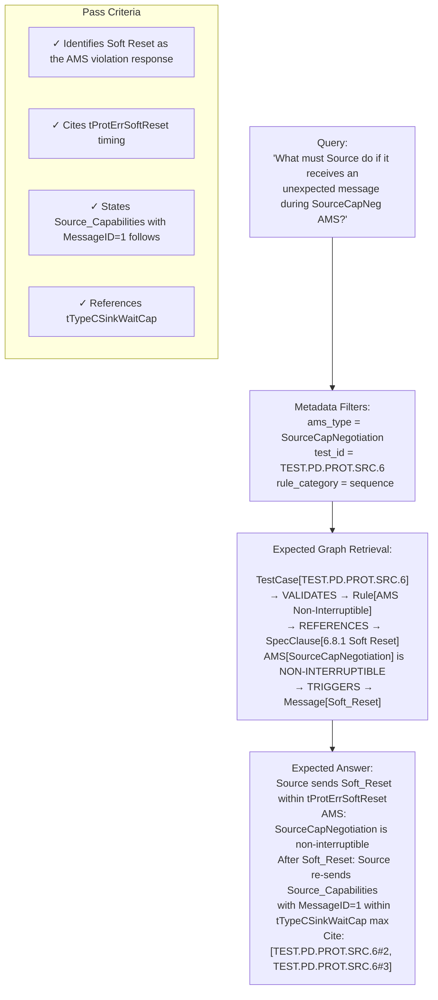

---

### TEST GROUP 2: Timer Compliance Tests (PD3 Mode)

---

#### TEST.PD.PROT.SRC3.1 — SourceCapabilityTimer Timeout

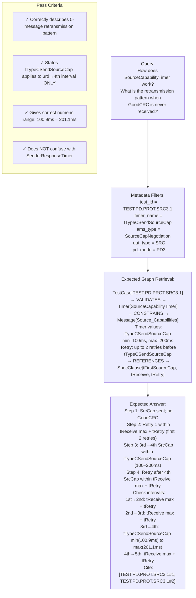

---

#### TEST.PD.PROT.SRC3.2 — SenderResponseTimer Timeout

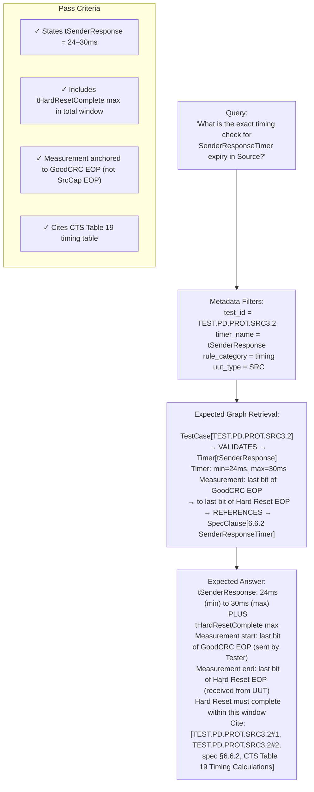

---

### TEST GROUP 3: Extended Message Tests (PD3 Mode)

---

#### TEST.PD.PROT.SRC3.3 — Get_Source_Cap_Extended Response

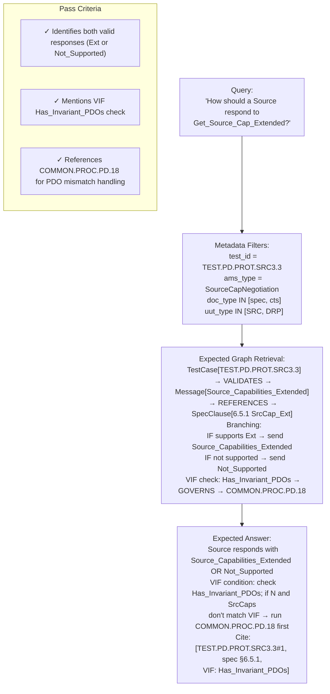

---

#### TEST.PD.PROT.SRC3.6 — Soft Reset Sent when SinkTxOK

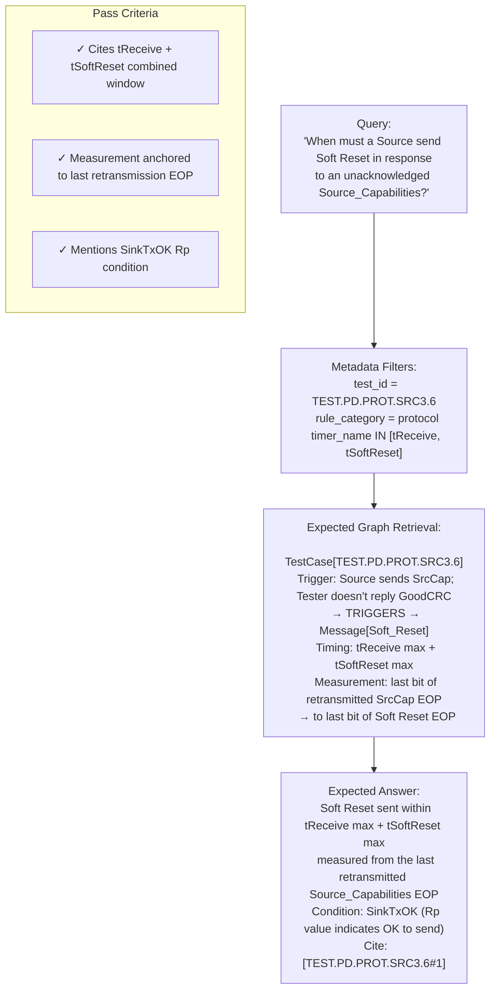

---

### TEST GROUP 4: Common Checks — GoodCRC and Message Header

---

#### COMMON.CHECK.PD.3 — GoodCRC Sequence Validation

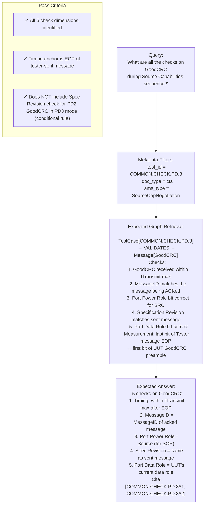

---

#### COMMON.CHECK.PD.7 — Source Capabilities Validity

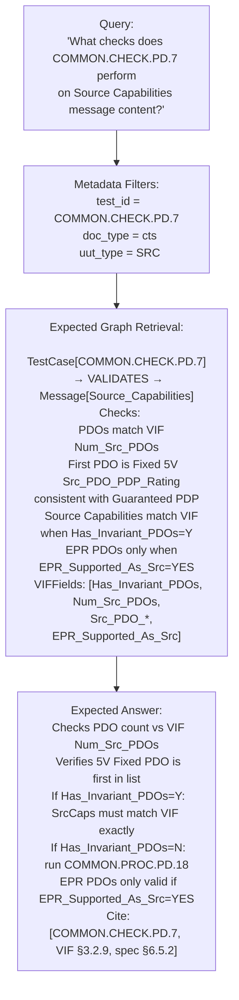

---

### TEST GROUP 5: Bring-Up Procedure Validation

---

#### COMMON.PROC.BU.1 — Standard Source Bring-Up

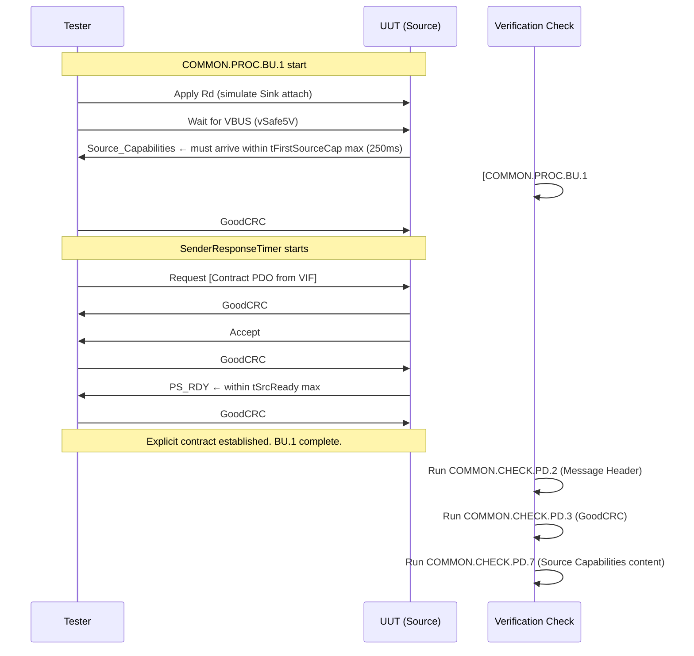

**RAG Query for this procedure:**

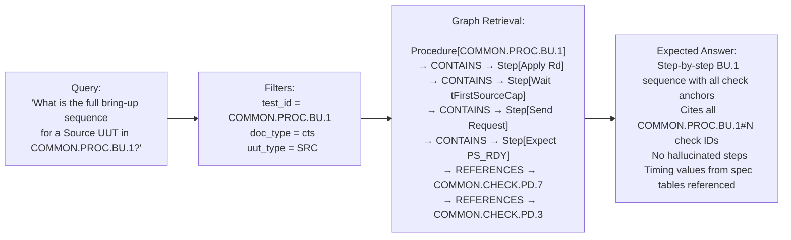

---

## VIF-Conditioned Test Routing

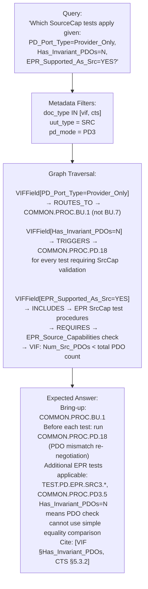

---

## End-to-End Test Execution Plan

```mermaid
flowchart TD
    subgraph PREP["Preparation: Index Validation"]
        PR1["Verify graph contains AMS[SourceCapNegotiation]\n(entity type = AMS, ams_type = SourceCapNegotiation)"]
        PR2["Verify all 10 CTS test cases are\nindexed as TestCase entities\n(TEST.PD.PROT.SRC3.1 through SRC3.6, SRC.1-SRC.6)"]
        PR3["Verify all timers indexed:\ntFirstSourceCap, tSenderResponse,\ntTypeCSendSourceCap, tReceive, tRetry"]
        PR4["Verify cross-links exist:\nTestCase → VALIDATES → AMS\nTestCase → CHECKS → Timer/Rule\nRule → REFERENCES → SpecClause"]
        PR5["Verify VIF fields indexed:\nHas_Invariant_PDOs, Num_Src_PDOs,\nEPR_Supported_As_Src, PD_Port_Type"]
    end

    subgraph EXEC["Execution: Query Tests"]
        E1["Run 10 compliance queries\n(one per CTS test case above)"]
        E2["Run 5 timer-specific queries\n(values, measurement anchors, combined windows)"]
        E3["Run 3 VIF-conditioned routing queries"]
        E4["Run 2 sequence violation queries\n(Reject path, Soft Reset path)"]
        E5["Run 1 RCA traversal query\n(SenderResponseTimer expiry RCA)"]
    end

    subgraph VAL["Validation: Answer Quality Checks"]
        V1["Citation completeness:\nEvery answer cites at least one\n[TEST.PD.PROT.* check anchor]"]
        V2["No hallucination:\nNo timer values beyond spec\ntFirstSourceCap, tSenderResponse bounds"]
        V3["Graph grounding:\nAnswer references entity IDs\n(ams_id, rule_id, clause_id)"]
        V4["Metadata filter effectiveness:\nSRC tests do NOT bleed into SNK\nPD3 tests do NOT appear in PD2 queries"]
        V5["Cross-document consistency:\nVIF field constraints align with\nCTS procedure applicability"]
        V6["Sequence ordering:\nAll multi-step sequences in\ncorrect AMS-defined order"]
    end

    subgraph FAIL_MODES["Expected Failure Modes to Test"]
        FM1["Timer value confusion:\nQuery mixing tSenderResponse vs\ntTypeCSendSourceCap → must return distinct values"]
        FM2["SRC vs SNK confusion:\nQuery for Source test must NOT\nreturn Sink-specific procedures"]
        FM3["PD2 vs PD3 mode:\nTEST.PD.PROT.SRC3.* tests are PD3 only\n→ must filter PD2 queries appropriately"]
        FM4["EPR boundary:\nQueries on SPR Source tests must NOT\ncontain EPR AMS steps unless UUT\nhas EPR_Supported_As_Src=YES"]
    end

    PREP --> EXEC --> VAL
    VAL --> FAIL_MODES
```

---

## Timer Lookup Test (Dedicated Vector Test)

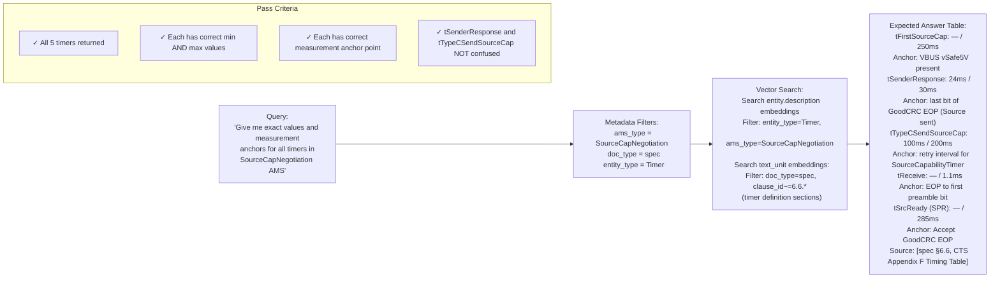

---

## Pass/Fail Summary Matrix

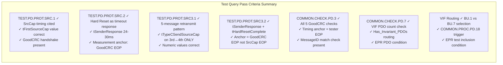
